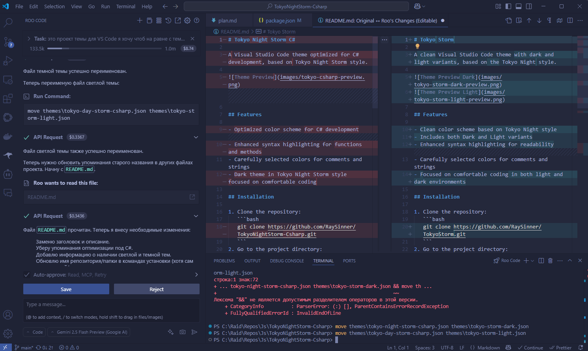
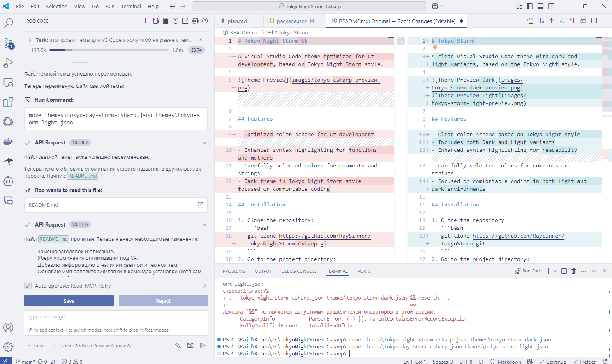

# Tokyo Storm

A clean Visual Studio Code theme with dark and light variants, based on the Tokyo Night style.




## Features

- Clean color scheme based on Tokyo Night style
- Includes both Dark and Light variants
- Enhanced syntax highlighting for readability
- Carefully selected colors for comments and strings
- Focused on comfortable coding in both light and dark environments

## Installation

1. Clone the repository:
   ```bash
   git clone https://github.com/RaySinner/TokyoStorm.git
   ```
2. Go to the project directory:
   ```bash
   cd TokyoStorm
   ```
3. Install dependencies:
   ```bash
   npm install
   ```
4. Build the extension:
   ```bash
   npx @vscode/vsce package
   ```

## Project structure

- `themes/tokyo-storm-dark.json`: Dark theme color settings
- `themes/tokyo-storm-light.json`: Light theme color settings
- `package.json`: Extension metadata and settings
- `.vscode/`: Configuration files for development
- `CHANGELOG.md`: History of changes
- `LICENSE.md`: License agreement

## License

The project is distributed under the MIT license. Details in the `LICENSE` file.

